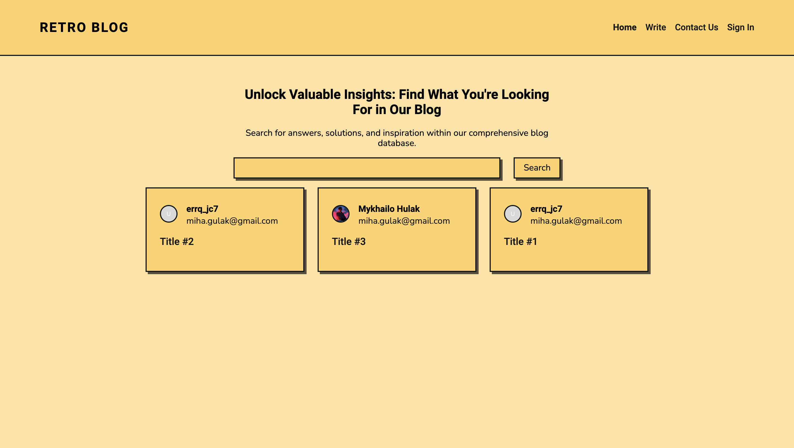
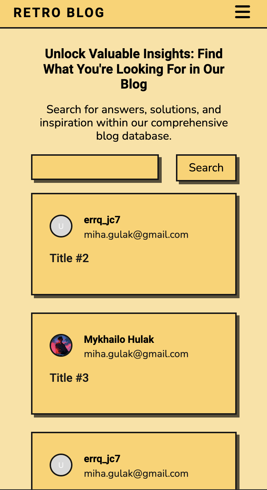

# Retro Blog

Web application for writing and reading publications built with react and Firebase.

## Screenshots




## How to set up on local machine

To set up project on your local machine follow steps written down below.

1. Create an account on [Firebase](https://firebase.google.com/) and set up a new project.
2. Go to "Build" -> "Authentication". Connect email and google authorization providers.
3. Go to "Build". Connect Firestore Database and Firebase Storage.
4. Go to "Extensions". Load module called "Trigger Mail" and repeat steps described in the [tutorial](https://www.youtube.com/watch?v=1nsnNLLnlrg).
5. In Firestore Database create collections "mails" and "publications".
6. Clone repo to your machine with `git clone https://github.com/midjiro/epam-coworking.git`
7. In the root of the project create a .env file with the following content:

````
REACT_APP_API_KEY = "..."
REACT_APP_MESSAGING_SENDER_ID = "..."
REACT_APP_APP_ID = "..."
REACT_APP_EMAIL = "admin email"
```


8. Replace "..." with apiKey, appId and messagingSenderId copied from Project Settings.
9. Execute `npm install`.
10. Execute `npm start`.
````
